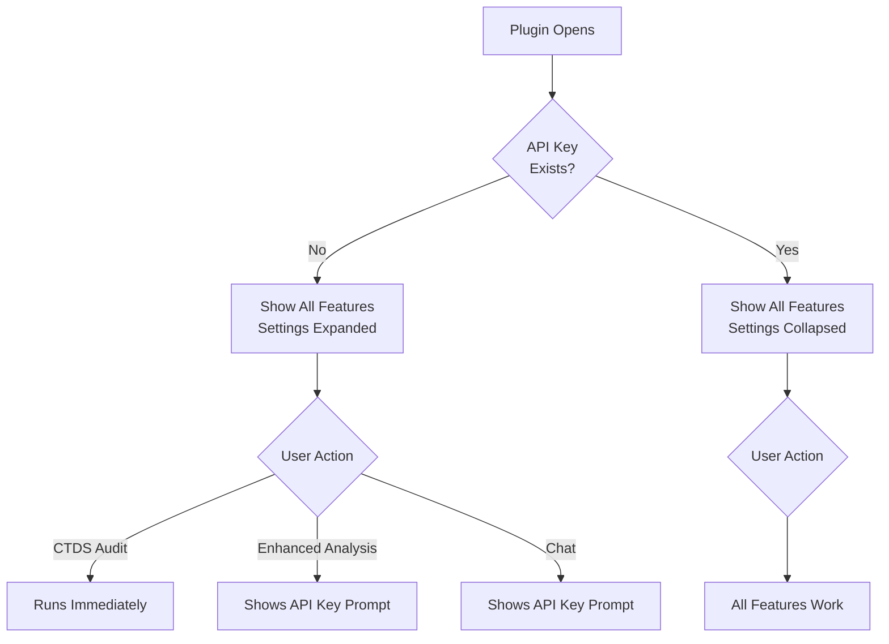

# Implementation Guide: Make API Key Optional

## Document Purpose

Create a comprehensive markdown file (`IMPLEMENTATION-GUIDE-OPTIONAL-API-KEY.md`) that documents how to implement the "optional API key" feature. This guide will enable other developers to:

- Understand the problem and solution
- Follow step-by-step implementation instructions
- Replicate the changes in similar projects
- Test the implementation thoroughly

## Document Structure

### 1. Problem Statement

**Content:**

- Current behavior: Plugin blocks all features until API key is entered
- Pain points: Users cannot explore non-AI features like CTDS Audit, token extraction, or validation
- User experience issues: Confusing UX, no clear separation between AI and non-AI features

### 2. Solution Overview

**Content:**

- Progressive disclosure approach
- Feature categorization (AI-powered vs rule-based)
- UI restructuring from blocking to collapsible settings
- Friendly prompts instead of disabled buttons

**Include a mermaid diagram:**




### 3. Architecture Changes

**Section A: Feature Matrix**

Table showing which features require API key:


| Feature               | Requires API Key | Why                    |
| --------------------- | ---------------- | ---------------------- |
| CTDS Audit            | No               | Rule-based validation  |
| Token Extraction      | No               | Direct node inspection |
| Collection Validation | No               | Structure checking     |
| Enhanced Analysis     | Yes              | AI-powered insights    |
| Batch Analysis        | Yes              | AI-powered             |
| Chat Interface        | Yes              | LLM-powered Q&A        |


**Section B: Data Flow**

Diagram showing message flow between UI and backend for both scenarios (with/without API key).

### 4. Implementation Steps

#### Step 1: UI Restructuring (`[ui-enhanced.html](ui-enhanced.html)`)

**A. Remove Blocking Configuration Card**

Location: Lines ~2251-2330

Before:

```html
<div class="card" id="api-key-card">
  <!-- Blocks entire UI when no key -->
</div>
```

After:

```html
<div class="collapsible" id="settings-card">
  <!-- Collapsible, non-blocking -->
</div>
```

**B. Create Collapsible Settings Section**

New HTML structure to add after line 2249:

- Collapsible header with status badge
- Provider selector
- Model selector
- API key input
- Save/Clear buttons
- Status container

Full code example to include in the guide.

**C. Update DOM References**

Lines ~2770-2778, change:

```javascript
const apiKeyCard = document.getElementById('api-key-card');
const hideConfigButton = document.getElementById('hide-config');
```

To:

```javascript
const settingsCard = document.getElementById('settings-card');
const settingsContent = document.getElementById('settings-content');
const settingsStatusBadge = document.getElementById('settings-status-badge');
```

And add:

```javascript
const clearKeyButton = document.getElementById('clear-key');
```

#### Step 2: Update Feature Gating Logic

**A. Modify handleApiKeyStatus() Function**

Location: Lines ~4173-4224

Changes needed:

1. Always show quick actions bar
2. Update settings badge based on key status
3. Auto-expand/collapse settings card
4. Show/hide clear key button
5. Keep chat tab enabled (remove disabled logic)

Full code replacement to include.

**B. Add API Key Prompt Function**

New function to add before `handleAnalyzeComponent()`:

```javascript
function showApiKeyPrompt(featureName) {
  updateStatus(`${featureName} requires an API key`, 'warning');
  
  const settingsHeader = settingsCard.querySelector('.collapsible-header');
  if (settingsHeader && !settingsHeader.classList.contains('active')) {
    toggleCollapsible(settingsHeader);
  }
  
  setTimeout(() => {
    apiKeyInput.focus();
  }, 300);
}
```

**C. Update handleAnalyzeComponent()**

Location: Line ~3927

Add API key check with prompt:

```javascript
function handleAnalyzeComponent() {
  if (!apiKeySaved) {
    showApiKeyPrompt('Enhanced Analysis');
    return;
  }
  // ... rest of function
}
```

**D. Update handleSendChat()**

Location: Line ~6289

Add API key check with tab switch:

```javascript
function handleSendChat() {
  // ... existing checks ...
  
  if (!apiKeySaved) {
    showApiKeyPrompt('Chat');
    switchTab('analyze');
    return;
  }
  // ... rest of function
}
```

**E. Update handleClearApiKey()**

Location: Lines ~3971-3987

Update to work with new settings structure, including UI state updates.

**F. Update handleApiKeySaved()**

Location: Lines ~4176-4201

Update to collapse settings and show status badge instead of hiding card.

**G. Deprecate updateAnalyzeButtonState()**

Location: Line ~6255

Change to no-op function:

```javascript
function updateAnalyzeButtonState(enabled) {
  // No-op: Buttons are always enabled, users see prompts for API key if needed
}
```

**H. Update Configuration Toggle Button**

Location: Lines ~3201-3211

Update show-config button to expand settings card instead of showing old card.

**I. Update Chat Input State**

Location: Lines ~7047-7058

Keep inputs enabled, just change placeholder text.

#### Step 3: Backend Message Handler Updates (`[src/ui/message-handler.ts](src/ui/message-handler.ts)`)

**A. Update handleEnhancedAnalyze()**

Location: Lines ~349-355

Change from throwing error to sending friendly message:

```typescript
if (!storedApiKey) {
  const providerName = getProvider(selectedProvider).name;
  sendMessageToUI('analysis-error', { 
    error: 'API Key Required',
    message: `Enhanced component analysis requires an API key. Please configure your ${providerName} API key in Settings.`,
    requiresApiKey: true
  });
  figma.notify(`Enhanced analysis requires an API key. Please configure one in Settings.`, { error: true });
  return;
}
```

**B. Update handleChatMessage()**

Location: Lines ~618-626

Similar change - return friendly error instead of throwing:

```typescript
if (!storedApiKey) {
  const providerName = getProvider(selectedProvider).name;
  sendMessageToUI('chat-error', { 
    error: `Chat requires an API key. Please configure your ${providerName} API key in Settings to start chatting.`,
    requiresApiKey: true
  });
  return;
}
```

**Note:** `handleSystemAudit()` already works without API key - no changes needed.

### 5. Event Listener Updates

Location in `[ui-enhanced.html](ui-enhanced.html)`: Lines ~3175-3181

Add clear key button listener:

```javascript
saveKeyButton.addEventListener('click', handleSaveApiKey);
clearKeyButton.addEventListener('click', handleClearApiKey);
quickAnalyzeButton.addEventListener('click', handleAnalyzeComponent);
```

### 6. Build and Deploy

Commands:

```bash
cd /path/to/figmalint
npm run build
```

This compiles TypeScript and copies assets to `dist/` folder.

### 7. Testing Guide

**Test Case 1: First Launch (No API Key)**

Steps:

1. Open plugin in Figma
2. Verify settings card is expanded
3. Verify badge shows "⚠️ AI features disabled"
4. Click "CTDS Audit" button
5. Verify it runs successfully
6. Click "Analyze Component" button
7. Verify prompt appears asking for API key
8. Switch to Chat tab
9. Try to send message
10. Verify switches back to Analyze tab with prompt

Expected: All non-AI features work, AI features show friendly prompts

**Test Case 2: Configuring API Key**

Steps:

1. Expand settings if collapsed
2. Select provider (e.g., Anthropic)
3. Enter valid API key
4. Select model
5. Click "Save Key"
6. Verify settings collapse automatically
7. Verify badge shows "✓ Configured"
8. Verify "Clear Key" button appears
9. Click "Analyze Component"
10. Verify analysis runs successfully

Expected: All features work after configuration

**Test Case 3: Clearing API Key**

Steps:

1. Click "Clear Key" button in settings
2. Confirm dialog
3. Verify settings expand
4. Verify badge shows "⚠️ AI features disabled"
5. Click "CTDS Audit"
6. Verify still works
7. Click "Analyze Component"
8. Verify prompt appears again

Expected: Returns to no-API-key state, non-AI features still work

**Test Case 4: Switching Providers**

Steps:

1. Configure Anthropic key
2. Expand settings
3. Switch to OpenAI
4. Verify models update
5. Enter OpenAI key
6. Save
7. Verify works with new provider

Expected: Provider switching works smoothly

### 8. Files Modified Summary

List all modified files with line count changes:

1. `[ui-enhanced.html](ui-enhanced.html)` (~200 lines changed)
  - Settings card restructure
  - Event handlers update
  - Feature gating logic
  - Prompt functions
2. `[src/ui/message-handler.ts](src/ui/message-handler.ts)` (~20 lines changed)
  - Friendly error messages
  - API key checks

### 9. Key Design Decisions

**Why collapsible instead of modal?**

- Keeps user in context
- Less intrusive
- Allows checking settings while viewing results

**Why not disable buttons?**

- Better UX - users understand why by clicking
- Progressive disclosure
- Clearer separation of features

**Why auto-expand settings when no key?**

- Guides new users
- Makes it obvious what's needed
- Collapses automatically after configuration

### 10. Common Pitfalls

1. **Forgetting to update all button state logic** - Search for `updateAnalyzeButtonState` calls
2. **Not handling both UI and backend checks** - API key validation needed in both places
3. **Missing event listener updates** - Clear key button needs listener
4. **Hardcoded element references** - Update all `apiKeyCard` references to `settingsCard`

### 11. Future Enhancements

Optional improvements not included in this implementation:

- Add "Get API Key" links to provider websites
- Implement key strength indicator
- Add usage/quota display
- Cache non-AI analysis results
- Add keyboard shortcuts (Cmd+K for settings)

## Document Formatting

The guide will use:

- Clear heading hierarchy
- Code blocks with syntax highlighting
- Tables for comparison
- Mermaid diagrams for flow visualization
- Step-by-step numbered instructions
- Before/after code examples
- Checkboxes for testing
- File path links in markdown format

## File Location

Create as: `/Users/christopherhall/Dev/figmalint/IMPLEMENTATION-GUIDE-OPTIONAL-API-KEY.md`

This provides a complete, shareable guide that documents the entire implementation process.