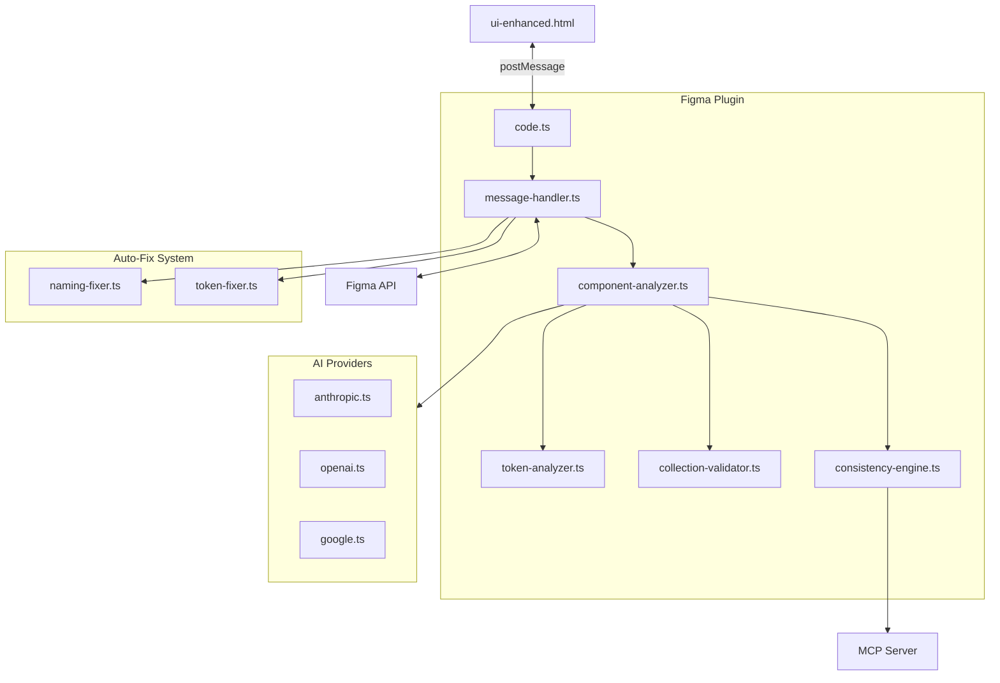

# FigmaLint Documentation

FigmaLint is a Figma plugin that analyzes components for design system compliance, extracts design tokens, provides AI-enhanced metadata generation, and offers auto-fix capabilities for naming and token binding issues.

## Table of Contents

- [Overview](#overview)
- [Key Features](#key-features)
- [Architecture](#architecture)
- [Technology Stack](#technology-stack)
- [Getting Started](#getting-started)
- [Project Structure](#project-structure)
- [Related Documentation](#related-documentation)

## Overview

FigmaLint helps design teams maintain consistency and quality in their Figma design systems by:

1. **Analyzing Components** - Extracts structure, properties, states, and design tokens from Figma components
2. **Validating Design Tokens** - Detects hard-coded values that should use variables or styles
3. **Enforcing Naming Conventions** - Identifies generic or inconsistent layer names
4. **Providing AI-Enhanced Insights** - Generates component metadata, accessibility recommendations, and semantic token suggestions
5. **Auto-Fixing Issues** - Binds tokens to variables and renames layers with one click

## Key Features

| Feature | Description | Requires AI |
|---------|-------------|-------------|
| Token Extraction | Detects colors, spacing, typography, effects, borders | No |
| Collection Validation | Validates variable collection structure | No |
| Naming Issue Detection | Finds generic/numbered layer names | No |
| Auto-Fix: Token Binding | Binds hard-coded values to variables | No |
| Auto-Fix: Layer Renaming | Applies semantic naming conventions | No |
| Component Metadata | Generates descriptions, props, usage guidelines | Yes |
| Accessibility Recommendations | WCAG-informed design suggestions | Yes |
| MCP Readiness Scoring | Design system compliance scoring | Yes |

## Architecture



### Core Components

- **Entry Point** (`src/code.ts`) - Initializes the plugin, shows UI, registers message handlers
- **Message Handler** (`src/ui/message-handler.ts`) - Routes 15+ message types between UI and plugin logic
- **Component Analyzer** (`src/core/component-analyzer.ts`) - Extracts component structure, properties, and states
- **Token Analyzer** (`src/core/token-analyzer.ts`) - Detects and categorizes design tokens
- **Collection Validator** (`src/core/collection-validator.ts`) - Validates variable collection structure
- **Consistency Engine** (`src/core/consistency-engine.ts`) - Caches results and integrates MCP knowledge

### Auto-Fix System

- **Token Fixer** (`src/fixes/token-fixer.ts`) - Binds hard-coded values to Figma variables
- **Naming Fixer** (`src/fixes/naming-fixer.ts`) - Applies semantic naming conventions

### AI Providers

- **Anthropic** - Claude models (claude-sonnet-4-5-20250929 default)
- **OpenAI** - GPT models (gpt-5.2 default)
- **Google** - Gemini models (gemini-2.5-pro default)

## Technology Stack

| Category | Technology |
|----------|------------|
| Language | TypeScript |
| Build Tool | esbuild |
| Runtime | Figma Plugin API |
| UI | Single-file HTML/CSS/JS (Carbon Design inspired) |
| AI Providers | Anthropic, OpenAI, Google |
| External Services | MCP Server for design systems knowledge |

## Getting Started

### Prerequisites

- Node.js (v16+)
- Figma Desktop App
- API key from Anthropic, OpenAI, or Google (optional, for AI features)

### Installation

1. Clone the repository:
   ```bash
   git clone <repository-url>
   cd figmalint
   ```

2. Install dependencies:
   ```bash
   npm install
   ```

3. Build the plugin:
   ```bash
   npm run build
   ```

4. Load in Figma:
   - Open Figma Desktop
   - Go to Plugins > Development > Import plugin from manifest
   - Select the `manifest.json` file

### Development

```bash
# Watch mode for development
npm run dev

# Build for production
npm run build
```

### Configuration

1. Open the plugin in Figma
2. Go to Settings tab
3. Select your AI provider (Anthropic, OpenAI, or Google)
4. Enter your API key
5. Select your preferred model

**Note:** AI features are optional. Token extraction, validation, and auto-fix capabilities work without an API key.

## Project Structure

```
figmalint/
├── src/
│   ├── code.ts                 # Plugin entry point
│   ├── types.ts                # TypeScript type definitions
│   ├── api/
│   │   ├── claude.ts           # Main AI integration
│   │   └── providers/          # Multi-provider support
│   │       ├── anthropic.ts
│   │       ├── google.ts
│   │       ├── openai.ts
│   │       ├── types.ts
│   │       └── index.ts
│   ├── core/
│   │   ├── component-analyzer.ts
│   │   ├── token-analyzer.ts
│   │   ├── collection-validator.ts
│   │   ├── consistency-engine.ts
│   │   └── types/
│   │       └── consistency.ts
│   ├── fixes/
│   │   ├── naming-fixer.ts
│   │   └── token-fixer.ts
│   ├── ui/
│   │   └── message-handler.ts
│   └── utils/
│       └── figma-helpers.ts
├── ui-enhanced.html            # Plugin UI
├── manifest.json               # Figma plugin manifest
├── figma.d.ts                  # Figma API type definitions
├── package.json
├── tsconfig.json
└── docs/                       # Documentation
    ├── README.md               # This file
    ├── architecture.md         # Technical architecture deep dive
    ├── ai-integration.md       # AI provider integration guide
    └── features.md             # Complete feature documentation
```

## Related Documentation

- [Architecture Deep Dive](./architecture.md) - Detailed technical architecture, data flows, and module dependencies
- [AI Integration Guide](./ai-integration.md) - Multi-provider AI system, feature matrix, and decoupling opportunities
- [Features & Capabilities](./features.md) - Complete feature documentation, validation rules, and auto-fix capabilities

## Network Access

The plugin requires network access to the following domains (configured in `manifest.json`):

- `https://api.anthropic.com` - Anthropic Claude API
- `https://api.openai.com` - OpenAI GPT API
- `https://generativelanguage.googleapis.com` - Google Gemini API
- `https://design-systems-mcp.southleft-llc.workers.dev` - MCP Server for design systems knowledge

## License

See [LICENSE](../LICENSE) for details.
