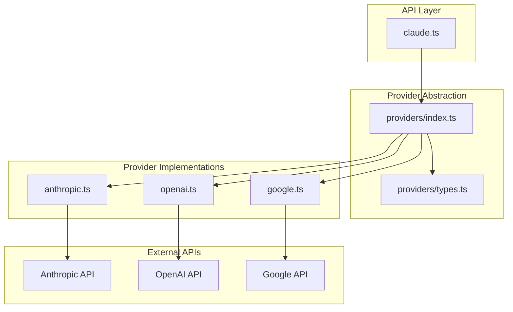
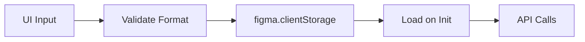
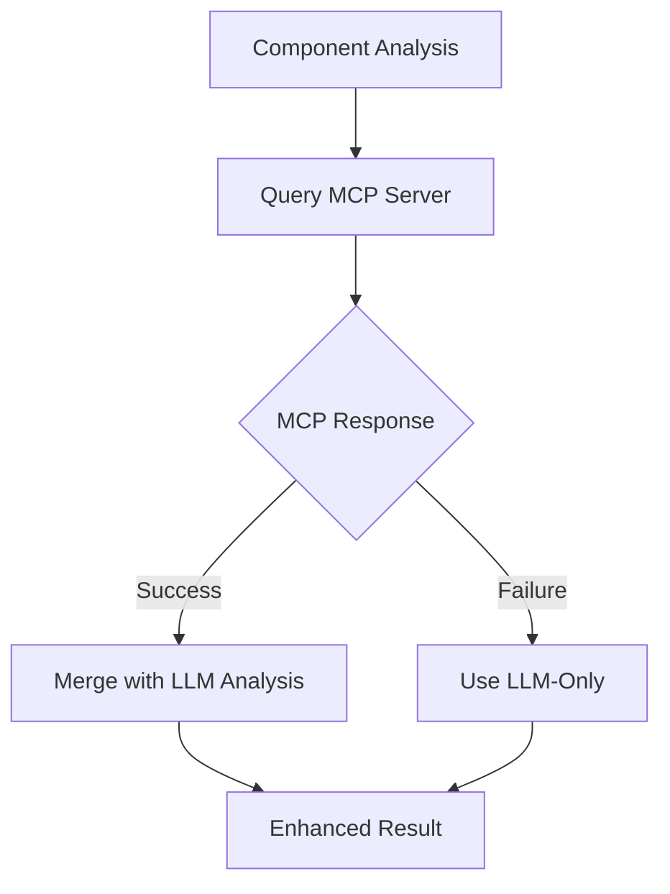
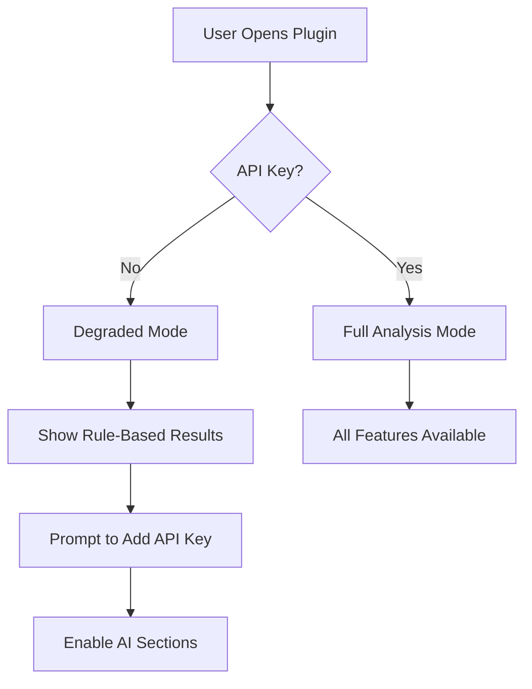

# AI Integration Guide

This document covers FigmaLint's multi-provider AI architecture, API integration details, and opportunities for decoupling AI-dependent features.

## Table of Contents

- [Multi-Provider Architecture](#multi-provider-architecture)
- [Provider Implementations](#provider-implementations)
- [API Key Management](#api-key-management)
- [Prompt Engineering](#prompt-engineering)
- [Error Handling](#error-handling)
- [MCP Server Integration](#mcp-server-integration)
- [AI vs Non-AI Feature Matrix](#ai-vs-non-ai-feature-matrix)
- [Decoupling Opportunities](#decoupling-opportunities)

## Multi-Provider Architecture

FigmaLint supports three AI providers through a unified abstraction layer:



### Unified Provider Interface

All providers implement the `LLMProvider` interface (`src/api/providers/types.ts`):

```typescript
interface LLMProvider {
  formatRequest(config: LLMRequestConfig): ProviderRequest;
  parseResponse(response: Response): Promise<LLMResponse>;
  validateApiKey(apiKey: string): boolean;
  getHeaders(apiKey: string): Record<string, string>;
  handleError(error: Error, response?: Response): LLMError;
  getDefaultModel(): string;
}
```

### Unified API Call

The `callProvider()` function (`src/api/providers/index.ts`) provides a unified interface:

```typescript
async function callProvider(
  providerId: ProviderId,
  apiKey: string,
  config: LLMRequestConfig
): Promise<LLMResponse>
```

**Process:**
1. Get provider implementation from registry
2. Validate API key format
3. Format request using provider's `formatRequest()`
4. Make HTTP request with provider-specific headers
5. Parse response using provider's `parseResponse()`
6. Handle errors using provider's `handleError()`

## Provider Implementations

### Anthropic (Claude)

**File:** `src/api/providers/anthropic.ts`

**Endpoint:** `https://api.anthropic.com/v1/messages`

**Supported Models:**
| Model ID | Tier | Description |
|----------|------|-------------|
| `claude-opus-4-5-20251218` | Flagship | Most capable |
| `claude-sonnet-4-5-20250929` | Standard | **Default** - balanced |
| `claude-haiku-4-5-20251001` | Economy | Fastest |

**Request Format:**
```json
{
  "model": "claude-sonnet-4-5-20250929",
  "messages": [{"role": "user", "content": "prompt"}],
  "max_tokens": 2048,
  "temperature": 0.1
}
```

**Headers:**
```
content-type: application/json
x-api-key: {apiKey}
anthropic-version: 2023-06-01
anthropic-dangerous-direct-browser-access: true
```

**API Key Validation:**
- Must start with `sk-ant-`
- Minimum length: 40 characters

### OpenAI (GPT)

**File:** `src/api/providers/openai.ts`

**Endpoint:** `https://api.openai.com/v1/chat/completions`

**Supported Models:**
| Model ID | Tier | Description |
|----------|------|-------------|
| `gpt-5.2` | Standard | **Default** |
| `gpt-5.2-pro` | Flagship | Most capable |
| `gpt-5-mini` | Economy | Fastest |

**Request Format:**
```json
{
  "model": "gpt-5.2",
  "messages": [{"role": "user", "content": "prompt"}],
  "max_completion_tokens": 2048,
  "temperature": 0.1
}
```

**Headers:**
```
content-type: application/json
Authorization: Bearer {apiKey}
```

**API Key Validation:**
- Must start with `sk-`
- Minimum length: 20 characters

### Google (Gemini)

**File:** `src/api/providers/google.ts`

**Endpoint:** `https://generativelanguage.googleapis.com/v1beta/models/{model}:generateContent`

**Supported Models:**
| Model ID | Tier | Description |
|----------|------|-------------|
| `gemini-3-pro-preview` | Flagship | Most capable |
| `gemini-2.5-pro` | Standard | **Default** |
| `gemini-2.5-flash` | Economy | Fastest |

**Request Format:**
```json
{
  "contents": [{"parts": [{"text": "prompt"}]}],
  "generationConfig": {
    "maxOutputTokens": 2048,
    "temperature": 0.1
  }
}
```

**Authentication:** URL-based (API key as query parameter)

**API Key Validation:**
- Must start with `AIza`
- Length: 30-50 characters
- Alphanumeric + underscore/hyphen only

## API Key Management

### Storage Architecture

API keys are stored securely using Figma's `clientStorage` API:



### Storage Keys

```typescript
`${providerId}-api-key`  // Per-provider API key
`selected-provider`      // Current provider ID
`selected-model`         // Current model ID
```

### Key Management Functions

**Load Configuration:**
```typescript
async function loadProviderConfig(): Promise<{
  provider: ProviderId;
  model: string;
  apiKey: string | null;
}>
```

**Save Configuration:**
```typescript
async function saveProviderConfig(
  provider: ProviderId,
  model: string,
  apiKey: string
): Promise<void>
```

**Clear Key:**
```typescript
async function clearProviderKey(provider: ProviderId): Promise<void>
```

### Legacy Migration

The system includes migration support for older single-provider storage:

```typescript
async function migrateLegacyStorage(): Promise<void>
// Migrates 'claude-api-key' to 'anthropic-api-key'
```

### Security Considerations

- Keys are stored locally in Figma plugin storage (not transmitted to any server except the AI provider)
- No server-side key storage
- Keys are validated before API calls
- Format validation prevents common mistakes

## Prompt Engineering

### Main Prompt Types

FigmaLint uses three primary prompt generation functions:

#### 1. Enhanced Metadata Prompt

**Function:** `createEnhancedMetadataPrompt()` in `src/api/claude.ts`

**Purpose:** Generate comprehensive component analysis

**Sections included:**
- Component context (name, type, hierarchy, colors, spacing, text)
- Analysis requirements (properties, tokens, states, boundaries)
- Code generation focus areas
- Container component guidelines
- Variant recommendations
- Design token focus areas
- Response format (structured JSON)
- Token naming conventions

**Output Schema:**
```json
{
  "component": { "name": "string", "purpose": "string" },
  "description": { "short": "string", "detailed": "string" },
  "props": [{ "name": "string", "type": "string", "required": "boolean" }],
  "states": ["string"],
  "variants": { "property": ["values"] },
  "tokens": { "colors": [], "spacing": [], "typography": [] },
  "propertyCheatSheet": { "property": "description" },
  "recommendedProperties": [{ "name": "string", "type": "string" }],
  "audit": { "tokenOpportunities": [], "structureIssues": [] },
  "mcpReadiness": { "score": "number", "strengths": [], "gaps": [] }
}
```

#### 2. Design Analysis Prompt

**Function:** `createDesignAnalysisPrompt()` in `src/api/claude.ts`

**Purpose:** Basic component analysis (lightweight)

**Includes:**
- Component name and structure
- Purpose analysis
- Variant detection
- Accessibility considerations
- Best practices

#### 3. MCP-Augmented Prompt

**Function:** `createMCPAugmentedPrompt()` in `src/api/claude.ts`

**Purpose:** Refine MCP-generated analysis into final JSON

**Input:** MCP server response + component context

**Output:** Refined, structured JSON analysis

### Prompt Configuration

All prompts use deterministic settings for consistency:

```typescript
{
  temperature: 0.1,    // Low randomness for reproducibility
  maxTokens: 2048,     // Sufficient for detailed analysis
  topP: 1,             // Full token selection
  frequencyPenalty: 0, // No frequency penalty
  presencePenalty: 0   // No presence penalty
}
```

## Error Handling

### Error Code Mapping

All providers map to unified error codes:

```typescript
enum LLMErrorCode {
  INVALID_API_KEY = 'INVALID_API_KEY',
  RATE_LIMIT_EXCEEDED = 'RATE_LIMIT_EXCEEDED',
  MODEL_NOT_FOUND = 'MODEL_NOT_FOUND',
  CONTEXT_LENGTH_EXCEEDED = 'CONTEXT_LENGTH_EXCEEDED',
  SERVER_ERROR = 'SERVER_ERROR',
  SERVICE_UNAVAILABLE = 'SERVICE_UNAVAILABLE',
  NETWORK_ERROR = 'NETWORK_ERROR',
  INVALID_REQUEST = 'INVALID_REQUEST',
  UNKNOWN_ERROR = 'UNKNOWN_ERROR'
}
```

### Provider-Specific Error Handling

**Anthropic:**
| HTTP Status | Error Code | Message |
|-------------|------------|---------|
| 400 | `INVALID_REQUEST` | Bad request with details |
| 401 | `INVALID_API_KEY` | Invalid API key |
| 403 | `INVALID_API_KEY` | Access forbidden |
| 429 | `RATE_LIMIT_EXCEEDED` | Rate limit with retry info |
| 500 | `SERVER_ERROR` | Server error |
| 503 | `SERVICE_UNAVAILABLE` | Service unavailable |

**OpenAI:**
| HTTP Status | Error Code | Message |
|-------------|------------|---------|
| 400 | `CONTEXT_LENGTH_EXCEEDED` | Context length exceeded |
| 401 | `INVALID_API_KEY` | Invalid API key |
| 404 | `MODEL_NOT_FOUND` | Model not found |
| 429 | `RATE_LIMIT_EXCEEDED` | Rate limit exceeded |
| 500/502/504 | `SERVER_ERROR` | Server/gateway error |

**Google:**
| Error Status | Error Code | Message |
|--------------|------------|---------|
| `RESOURCE_EXHAUSTED` | `RATE_LIMIT_EXCEEDED` | Rate limit exceeded |
| `INVALID_ARGUMENT` | `INVALID_REQUEST` | Invalid argument |
| Safety filter block | `INVALID_REQUEST` | Content filtered |

### Rate Limiting

Current implementation:
- Extracts `retry-after` header when available
- Returns retry information in error message
- **No automatic retry logic** (potential improvement area)
- **No request queuing** (potential improvement area)

## MCP Server Integration

### Overview

FigmaLint integrates with an MCP (Model Context Protocol) server for design systems knowledge:

**Server URL:** `https://design-systems-mcp.southleft-llc.workers.dev/mcp`

### Integration Flow



### MCP Request Format

```typescript
interface MCPSearchRequest {
  query: string;
  categories?: ('components' | 'tokens' | 'patterns' | 'accessibility')[];
}
```

### Usage Contexts

1. **Component Analysis Enhancement** - Fetches best practices for component families
2. **Chat Context Enrichment** - Provides design systems knowledge for chat responses
3. **Consistency Validation** - Validates against design system standards

### Fallback Behavior

When MCP is unavailable:
- Falls back to built-in knowledge base
- Uses LLM-only analysis
- Caches results for offline use

## AI vs Non-AI Feature Matrix

### Complete Feature Breakdown

| Feature | Category | Requires AI | Works Offline | Notes |
|---------|----------|-------------|---------------|-------|
| **Token Detection** | | | | |
| Extract Figma styles | Extraction | No | Yes | Rule-based |
| Extract Figma variables | Extraction | No | Yes | Rule-based |
| Detect hard-coded values | Extraction | No | Yes | Rule-based |
| Categorize tokens (color/spacing/etc) | Extraction | No | Yes | Rule-based |
| **Validation** | | | | |
| Collection structure validation | Validation | No | Yes | Rule-based |
| Category completeness check | Validation | No | Yes | Rule-based |
| Naming convention enforcement | Validation | No | Yes | Pattern matching |
| Text style/variable sync | Validation | No | Yes | Rule-based |
| Mirror category validation | Validation | No | Yes | Rule-based |
| **Component Analysis** | | | | |
| Structure extraction | Analysis | No | Yes | Traverses node tree |
| Property detection | Analysis | No | Yes | Multi-method fallback |
| State extraction | Analysis | No | Yes | Variant analysis |
| Slot detection | Analysis | No | Yes | Structure analysis |
| Component family detection | Analysis | No | Yes | Pattern matching |
| **Auto-Fix** | | | | |
| Token binding (color) | Fix | No | Yes | Variable matching |
| Token binding (spacing) | Fix | No | Yes | Variable matching |
| Layer renaming | Fix | No | Yes | Pattern-based |
| Batch operations | Fix | No | Yes | Iterative application |
| **AI-Enhanced** | | | | |
| Component metadata generation | Metadata | **Yes** | No | LLM required |
| Semantic token recommendations | Recommendations | **Yes** | No | LLM required |
| Accessibility recommendations | Recommendations | **Yes** | No | LLM required |
| MCP readiness scoring | Scoring | **Yes** | No | LLM + MCP |
| Property recommendations | Recommendations | **Yes** | No | LLM required |
| Usage guidelines | Documentation | **Yes** | No | LLM required |
| Design systems chat | Chat | **Yes** | No | LLM + MCP |

### Summary Statistics

| Category | Total Features | AI Required | Works Without AI |
|----------|---------------|-------------|------------------|
| Token Detection | 4 | 0 | 4 |
| Validation | 5 | 0 | 5 |
| Component Analysis | 5 | 0 | 5 |
| Auto-Fix | 4 | 0 | 4 |
| AI-Enhanced | 6 | 6 | 0 |
| **Total** | **24** | **6 (25%)** | **18 (75%)** |

## Decoupling Opportunities

### Current State

The plugin's AI features are tightly coupled with the analysis flow. However, 75% of functionality works without AI.

### Recommended Decoupling Strategies

#### 1. Degraded Mode UI

**Current:** UI shows loading state indefinitely without API key

**Proposed:** Show full rule-based analysis results with AI sections disabled



**Implementation:**
- Add `aiEnabled` flag to analysis results
- Conditionally render AI sections in UI
- Show "Add API Key for more insights" prompts

#### 2. Standalone Linting Plugin

**Concept:** Extract non-AI features into a separate, free plugin

**Features to include:**
- Token extraction and analysis
- Collection structure validation
- Naming issue detection
- Auto-fix: token binding
- Auto-fix: layer renaming

**Benefits:**
- Lower barrier to entry
- No API key required
- Faster performance
- Potential upsell to full version

#### 3. Modular AI Integration

**Current:** AI calls embedded in component analyzer

**Proposed:** Separate AI module with clear boundaries

```typescript
// New structure
interface AnalysisResult {
  ruleBasedAnalysis: RuleBasedResult;  // Always available
  aiEnhancedAnalysis?: AIResult;        // Optional
}

async function analyze(node: SceneNode, options: {
  includeAI: boolean;
  provider?: ProviderId;
  apiKey?: string;
}): Promise<AnalysisResult>
```

#### 4. Caching AI Results

**Current:** AI called for every analysis

**Proposed:** Aggressive caching with manual refresh

**Implementation:**
- Cache AI results by component hash (already partially implemented)
- Extend cache duration (currently 24 hours)
- Add "Refresh AI Analysis" button
- Show cached results immediately, update in background

#### 5. Batch Processing Optimization

**Current:** Individual API calls per component

**Proposed:** Batch multiple components in single request

**Implementation:**
```typescript
async function batchAnalyze(
  nodes: SceneNode[],
  options: BatchOptions
): Promise<AnalysisResult[]> {
  // 1. Extract all component contexts (rule-based, fast)
  const contexts = await Promise.all(nodes.map(extractContext));
  
  // 2. Single batched AI call
  const aiResults = await batchAICall(contexts, options);
  
  // 3. Merge results
  return mergeResults(contexts, aiResults);
}
```

### Implementation Priority

| Strategy | Effort | Impact | Priority |
|----------|--------|--------|----------|
| Degraded Mode UI | Low | High | **1** |
| Caching AI Results | Medium | High | **2** |
| Modular AI Integration | Medium | Medium | **3** |
| Standalone Linting Plugin | High | High | **4** |
| Batch Processing Optimization | Medium | Medium | **5** |

### Migration Path

1. **Phase 1:** Implement degraded mode UI
   - Users can see value without API key
   - Clear path to enable AI features

2. **Phase 2:** Enhance caching
   - Reduce API costs
   - Improve response times

3. **Phase 3:** Modularize AI integration
   - Clean architecture
   - Easier testing
   - Potential for multiple AI strategies

4. **Phase 4:** Consider standalone plugin
   - Market validation from Phase 1-3
   - Clear value proposition

## JSON Response Extraction

### Challenge

LLM responses may contain markdown, explanations, or malformed JSON.

### Extraction Strategies

FigmaLint uses multiple fallback strategies:

1. **Balanced Brace Counting** - Find matching `{` and `}`
2. **Delimiter-Based Extraction** - Look for ````json` blocks
3. **Code Block Extraction** - Extract from markdown code blocks
4. **Regex Fallback** - Pattern matching for JSON objects

**Implementation:**
```typescript
function extractJSONFromResponse(content: string): object | null {
  // Strategy 1: Balanced braces
  // Strategy 2: Delimiters
  // Strategy 3: Code blocks
  // Strategy 4: Regex
  // Fallback: Return basic component info
}
```

### Truncation Handling

For very long responses that get truncated:
- Attempt to repair incomplete JSON
- Extract partial data when possible
- Fall back to basic component information
