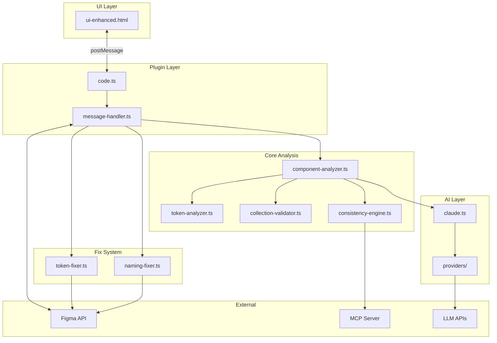
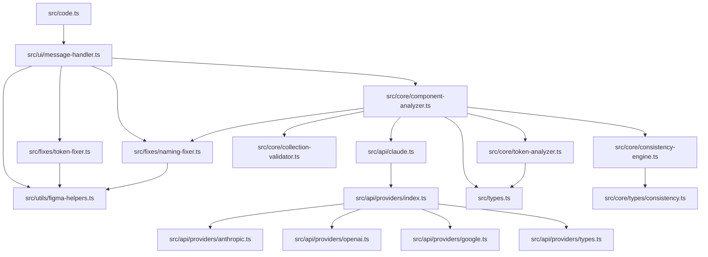
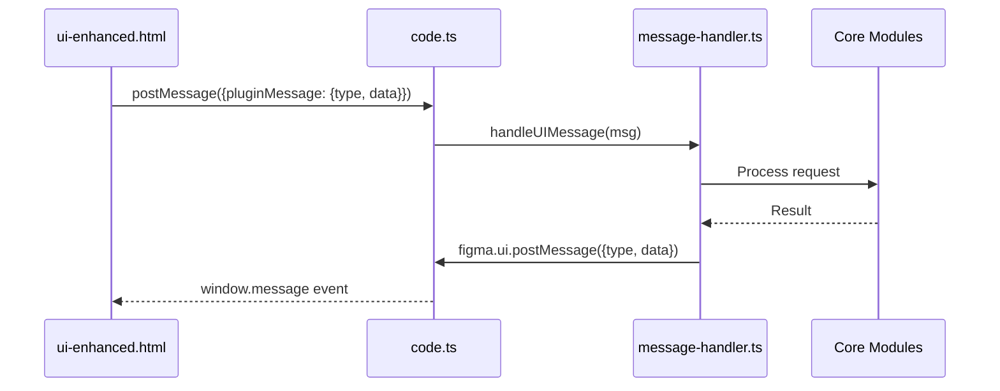
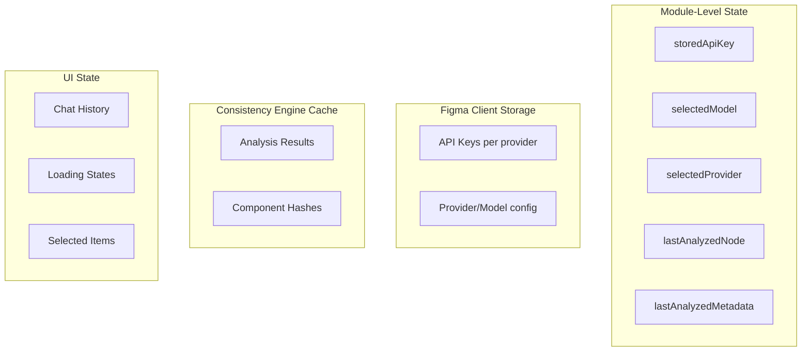
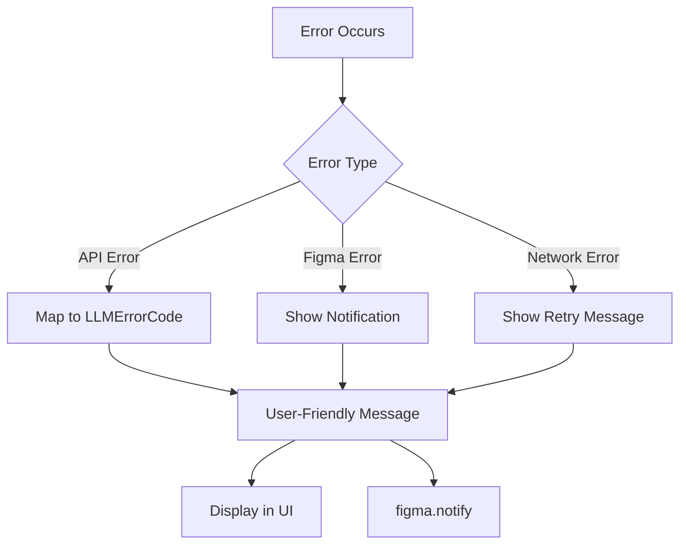

# FigmaLint Architecture

This document provides a detailed technical overview of the FigmaLint plugin architecture, including module dependencies, data flows, message passing, and state management.

## Table of Contents

- [High-Level Architecture](#high-level-architecture)
- [Module Dependencies](#module-dependencies)
- [Data Flow](#data-flow)
- [Message Passing Architecture](#message-passing-architecture)
- [State Management](#state-management)
- [Build System](#build-system)

## High-Level Architecture

FigmaLint follows a modular architecture with clear separation of concerns:



## Module Dependencies

### Dependency Graph



### Module Responsibilities

| Module | Location | Responsibility |
|--------|----------|----------------|
| Entry Point | `src/code.ts` | Initialize plugin, show UI, register handlers |
| Message Handler | `src/ui/message-handler.ts` | Route messages between UI and plugin logic |
| Component Analyzer | `src/core/component-analyzer.ts` | Extract component structure, properties, states |
| Token Analyzer | `src/core/token-analyzer.ts` | Detect and categorize design tokens |
| Collection Validator | `src/core/collection-validator.ts` | Validate variable collection structure |
| Consistency Engine | `src/core/consistency-engine.ts` | Cache results, integrate MCP knowledge |
| Claude API | `src/api/claude.ts` | Main AI integration, prompt engineering |
| Providers | `src/api/providers/` | Multi-provider abstraction layer |
| Token Fixer | `src/fixes/token-fixer.ts` | Bind hard-coded values to variables |
| Naming Fixer | `src/fixes/naming-fixer.ts` | Apply semantic naming conventions |
| Figma Helpers | `src/utils/figma-helpers.ts` | Figma API utilities |

## Data Flow

### Complete Analysis Pipeline

```mermaid
flowchart LR
    subgraph stage1 [Stage 1: Selection]
        S1[User selects node]
        S2[figma.currentPage.selection]
    end
    
    subgraph stage2 [Stage 2: Context]
        C1[extractComponentContext]
        C2[ComponentContext object]
    end
    
    subgraph stage3 [Stage 3: Tokens]
        T1[extractDesignTokensFromNode]
        T2[TokenAnalysis object]
    end
    
    subgraph stage4 [Stage 4: AI]
        A1{API Key?}
        A2[LLM Processing]
        A3[Rule-based Only]
    end
    
    subgraph stage5 [Stage 5: Results]
        R1[EnhancedAnalysisResult]
        R2[UI Display]
    end
    
    subgraph stage6 [Stage 6: Fix]
        F1[User clicks Fix]
        F2[Apply to Figma]
    end
    
    S1 --> S2 --> C1 --> C2 --> T1 --> T2 --> A1
    A1 -->|Yes| A2 --> R1
    A1 -->|No| A3 --> R1
    R1 --> R2 --> F1 --> F2
```



### Stage Details

#### Stage 1: Figma Selection → Context Extraction

**Input:** `SceneNode` from Figma selection

**Process:**
1. Validate node type (FRAME, COMPONENT, COMPONENT_SET, INSTANCE, GROUP)
2. Extract layer hierarchy via `extractLayerHierarchy()`
3. Extract text content via `extractTextContent()`
4. Detect styles (fills, strokes, effects)
5. Detect slots and variants
6. Analyze component family and use case

**Output:** `ComponentContext` object

```typescript
interface ComponentContext {
  name: string;
  type: string;
  hierarchy: LayerInfo[];
  textContent: string;
  frameStructure: FrameStructure;
  detectedStyles: DetectedStyles;
  detectedSlots: SlotInfo[];
  potentialVariants: VariantInfo[];
  additionalContext: AdditionalContext;
}
```

#### Stage 2: Context → Token Analysis

**Input:** `ComponentContext` + node tree

**Process:**
1. Traverse node tree recursively
2. For each node, extract:
   - Colors (fills, strokes, styles, variables)
   - Spacing (padding, gaps, corner radius)
   - Typography (text styles, font properties)
   - Effects (shadows, blurs, opacity)
   - Borders (stroke weights, corner radii)
3. Categorize each value:
   - `isToken: true` → already bound to variable/style
   - `isToken: false` → hard-coded value
4. Filter out default variant styles (purple stroke, 5px radius)

**Output:** `TokenAnalysis` object

```typescript
interface TokenAnalysis {
  colors: TokenInfo[];
  spacing: TokenInfo[];
  typography: TokenInfo[];
  effects: TokenInfo[];
  borders: TokenInfo[];
  summary: TokenSummary;
}
```

#### Stage 3: Analysis → AI Enhancement (Optional)

**Input:** `ComponentContext` + `TokenAnalysis`

**Process (with API key):**
1. Extract actual Figma properties and states
2. Create LLM prompt with `createEnhancedMetadataPrompt()`
3. Call provider via `callProvider(providerId, apiKey, config)`
4. Query MCP server for design systems knowledge
5. Merge LLM and MCP results

**Process (without API key):**
1. Return rule-based analysis only
2. Skip metadata generation and recommendations

**Output:** `ComponentMetadata` object

#### Stage 4: Results → UI Display

**Input:** All analysis data

**Process:**
1. Combine metadata, tokens, and audit results
2. Analyze naming issues via `analyzeNamingIssues()`
3. Create `EnhancedAnalysisResult`
4. Send to UI via `sendMessageToUI()`

**Output:** `EnhancedAnalysisResult` object

```typescript
interface EnhancedAnalysisResult {
  metadata: ComponentMetadata;
  tokens: TokenAnalysis;
  audit: DetailedAuditResults;
  properties: PropertyDefinition[];
  recommendations: Recommendation[];
  namingIssues: NamingIssue[];
}
```

#### Stage 5: Fix Application

**Input:** Fix request from UI

**Process (Token Fix):**
1. Find matching variable via `findMatchingColorVariable()` or `findBestMatchingVariable()`
2. Preview fix via `previewFix()`
3. Apply binding via `applyColorFix()` or `applySpacingFix()`

**Process (Naming Fix):**
1. Generate suggested name via `suggestLayerName()`
2. Preview rename via `previewRename()`
3. Apply rename via `renameLayer()`

**Output:** Updated Figma node

## Message Passing Architecture

### Bidirectional Communication



### Message Types

#### UI → Plugin Messages

| Message Type | Purpose | Handler |
|--------------|---------|---------|
| `check-api-key` | Verify API key status | `handleCheckApiKey()` |
| `save-api-key` | Store API key | `handleSaveApiKey()` |
| `update-model` | Change AI model | `handleUpdateModel()` |
| `analyze` | Basic analysis | `handleAnalyze()` |
| `analyze-enhanced` | Full analysis with AI | `handleEnhancedAnalyze()` |
| `chat-message` | Send chat query | `handleChatMessage()` |
| `chat-clear-history` | Clear chat | `handleClearChatHistory()` |
| `preview-fix` | Preview a fix | `handlePreviewFix()` |
| `apply-token-fix` | Apply token binding | `handleApplyTokenFix()` |
| `apply-naming-fix` | Apply rename | `handleApplyNamingFix()` |
| `apply-batch-fix` | Apply multiple fixes | `handleApplyBatchFix()` |
| `select-node` | Navigate to node | `handleSelectNode()` |
| `update-description` | Update component description | `handleUpdateDescription()` |
| `add-component-property` | Add property to component | `handleAddComponentProperty()` |

#### Plugin → UI Messages

| Message Type | Purpose |
|--------------|---------|
| `api-key-status` | API key validation result |
| `api-key-saved` | Confirmation of key storage |
| `api-key-cleared` | Confirmation of key removal |
| `enhanced-analysis-result` | Full analysis results |
| `batch-analysis-result` | Batch analysis results |
| `analysis-error` | Error during analysis |
| `fix-preview` | Preview of proposed fix |
| `fix-applied` | Confirmation of fix application |
| `batch-fix-applied` | Confirmation of batch fixes |
| `chat-response` | Chat response from AI |
| `chat-response-loading` | Chat loading state |
| `chat-error` | Chat error |
| `description-updated` | Confirmation of description update |
| `property-added` | Confirmation of property addition |

### Implementation Details

**UI → Plugin (in `ui-enhanced.html`):**
```javascript
function sendMessageToPlugin(type, data) {
  parent.postMessage({ pluginMessage: { type, data } }, '*');
}
```

**Plugin → UI (in `src/utils/figma-helpers.ts`):**
```typescript
export function sendMessageToUI(type: string, data?: unknown): void {
  figma.ui.postMessage({ type, data });
}
```

**Message Handler (in `src/ui/message-handler.ts`):**
```typescript
export async function handleUIMessage(msg: UIMessage): Promise<void> {
  switch (msg.type) {
    case 'analyze-enhanced':
      await handleEnhancedAnalyze(msg);
      break;
    // ... other handlers
  }
}
```

## State Management

### State Locations



### Module-Level State

Located in `src/ui/message-handler.ts`:

```typescript
let storedApiKey: string | null = null;
let selectedModel: string = 'claude-sonnet-4-5-20250929';
let selectedProvider: ProviderId = 'anthropic';
let lastAnalyzedMetadata: ComponentMetadata | null = null;
let lastAnalyzedNode: SceneNode | null = null;
```

### Figma Client Storage

Persisted across sessions using `figma.clientStorage`:

```typescript
// Storage keys
`${providerId}-api-key`  // API key per provider
`selected-provider`      // Current provider ID
`selected-model`         // Current model ID
```

**Functions:**
- `loadProviderConfig()` - Load provider, model, and API key
- `saveProviderConfig()` - Save configuration
- `clearProviderKey()` - Remove API key for provider

### Consistency Engine Cache

Located in `src/core/consistency-engine.ts`:

```typescript
interface ComponentAnalysisCache {
  hash: string;              // Component structure hash
  result: ComponentMetadata; // Cached analysis
  timestamp: number;         // Cache creation time
  mcpKnowledgeVersion: string; // MCP version used
}
```

**Cache behavior:**
- 24-hour expiration
- Hash-based lookup
- Invalidates on structure changes

### UI State

Managed in `ui-enhanced.html` JavaScript:

```javascript
let apiKeySaved = false;
let selectedProvider = 'anthropic';
let selectedModel = 'claude-sonnet-4-5-20250929';
let chatHistory = [];
let isWaitingForResponse = false;
```

## Build System

### Build Configuration

**esbuild** is used for bundling TypeScript:

```json
{
  "scripts": {
    "build": "esbuild src/code.ts --bundle --outfile=dist/code.js --format=iife",
    "dev": "esbuild src/code.ts --bundle --outfile=dist/code.js --format=iife --watch"
  }
}
```

### Build Output

```
dist/
├── code.js          # Bundled plugin code (IIFE format)
├── manifest.json    # Copied from src/
└── ui-enhanced.html # Copied from root
```

### TypeScript Configuration

Key settings from `tsconfig.json`:
- Target: ES2017 (for async/await support)
- Module: ESNext (for dynamic imports)
- Strict mode enabled
- Figma plugin types included

## Figma API Usage

### Core APIs

| API | Purpose |
|-----|---------|
| `figma.currentPage.selection` | Get selected nodes |
| `figma.getNodeByIdAsync()` | Async node lookup |
| `figma.viewport.scrollAndZoomIntoView()` | Navigate to nodes |
| `figma.variables.getVariableByIdAsync()` | Get variable by ID |
| `figma.clientStorage` | Persist plugin data |
| `figma.notify()` | Show notifications |
| `figma.loadFontAsync()` | Load fonts for text |

### Node Properties Accessed

- **Layout:** `layoutMode`, `paddingTop/Right/Bottom/Left`, `itemSpacing`
- **Visual:** `fills`, `strokes`, `effects`, `cornerRadius`, `opacity`
- **Typography:** `fontName`, `fontSize`, `textAlignHorizontal`, `lineHeight`
- **Structure:** `name`, `type`, `visible`, `locked`, `width`, `height`
- **Components:** `componentProperties`, `variantGroupProperties`

### Variable Binding

Token binding uses the Figma variables API:

```typescript
// Color binding
node.fills = [{
  type: 'VARIABLE',
  variableId: variable.id
}];

// Spacing binding
node.setBoundVariable('paddingTop', variable);
```

## Error Handling

### Error Flow



### Error Types

**LLM Errors** (`src/api/providers/types.ts`):
- `INVALID_API_KEY`
- `RATE_LIMIT_EXCEEDED`
- `MODEL_NOT_FOUND`
- `CONTEXT_LENGTH_EXCEEDED`
- `SERVER_ERROR`
- `SERVICE_UNAVAILABLE`
- `NETWORK_ERROR`
- `INVALID_REQUEST`
- `UNKNOWN_ERROR`

### Graceful Degradation

- MCP unavailable → Falls back to LLM-only
- LLM unavailable → Returns rule-based analysis only
- Cache miss → Performs fresh analysis
