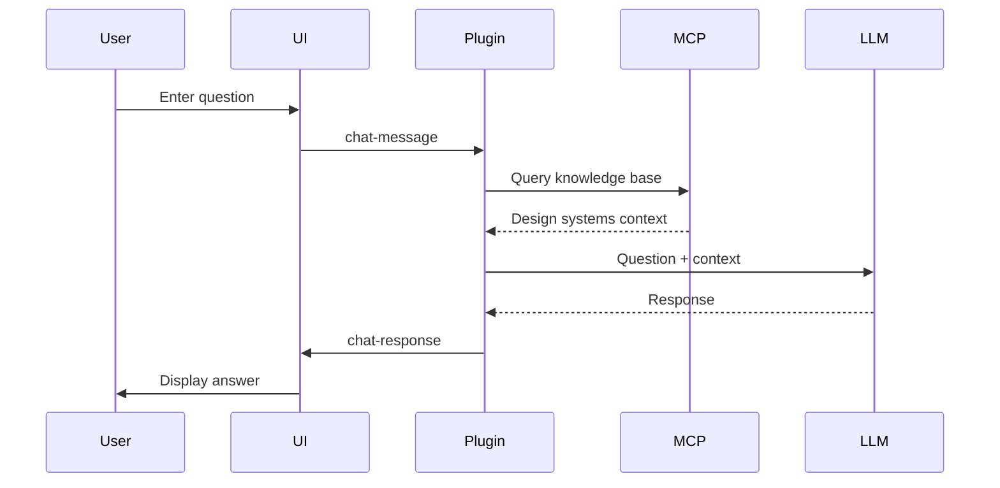

# Features & Capabilities

This document provides comprehensive documentation of all FigmaLint features, including token analysis, validation rules, component analysis, and auto-fix capabilities.

## Table of Contents

- [Token Analysis](#token-analysis)
- [Validation Rules](#validation-rules)
- [Component Analysis](#component-analysis)
- [Auto-Fix Capabilities](#auto-fix-capabilities)
- [UI Features](#ui-features)
- [Chat Interface](#chat-interface)

## Token Analysis

The token analyzer (`src/core/token-analyzer.ts`) extracts and categorizes design tokens from Figma nodes.

### Token Categories

#### Colors

**Detection sources:**
| Source | Priority | Description |
|--------|----------|-------------|
| Fill Styles | 1 | Figma named fill styles |
| Stroke Styles | 1 | Figma named stroke styles |
| Fill Variables | 2 | Figma variables bound to fills |
| Stroke Variables | 2 | Figma variables bound to strokes |
| Hard-coded Fills | 3 | Solid colors without style/variable |
| Hard-coded Strokes | 3 | Stroke colors without style/variable |

**Filtering:**
- Transparent colors are excluded
- Default variant frame styles (#9747FF purple) are filtered

**Output:**
```typescript
interface ColorToken {
  value: string;           // Hex color value
  name?: string;           // Variable/style name if bound
  source: 'figma-variable' | 'figma-style' | 'hard-coded';
  isToken: boolean;        // true if bound to variable/style
  nodeContext: {
    nodeId: string;
    nodeName: string;
    nodeType: string;
    propertyPath: string;  // e.g., 'fills[0]'
  };
}
```

#### Spacing

**Detection sources:**
| Property | Variable Support | Description |
|----------|-----------------|-------------|
| `paddingTop` | Yes | Top padding |
| `paddingRight` | Yes | Right padding |
| `paddingBottom` | Yes | Bottom padding |
| `paddingLeft` | Yes | Left padding |
| `itemSpacing` | Yes | Auto-layout gap |
| `counterAxisSpacing` | Yes | Counter-axis gap |
| `width` | Yes | Node width |
| `height` | Yes | Node height |
| `minWidth` | Yes | Minimum width |
| `maxWidth` | Yes | Maximum width |
| `minHeight` | Yes | Minimum height |
| `maxHeight` | Yes | Maximum height |

**Filtering:**
- Default variant padding (16px) is filtered in variant contexts

**Output:**
```typescript
interface SpacingToken {
  value: number;           // Pixel value
  property: string;        // Property name
  name?: string;           // Variable name if bound
  source: 'figma-variable' | 'hard-coded';
  isToken: boolean;
  nodeContext: NodeContext;
}
```

#### Typography

**Detection sources:**
| Property | Type | Description |
|----------|------|-------------|
| Text Styles | Style | Figma named text styles |
| `fontSize` | Variable | Font size variables |
| `lineHeight` | Variable | Line height variables |
| `letterSpacing` | Variable | Letter spacing variables |
| `paragraphSpacing` | Variable | Paragraph spacing variables |

**Hard-coded detection:**
- Font family without text style
- Font size without variable
- Line height without variable
- Letter spacing without variable

**Output:**
```typescript
interface TypographyToken {
  value: string | number;
  property: 'fontFamily' | 'fontSize' | 'lineHeight' | 'letterSpacing' | 'textStyle';
  name?: string;
  source: 'figma-variable' | 'figma-style' | 'hard-coded';
  isToken: boolean;
  nodeContext: NodeContext;
}
```

#### Effects

**Detection sources:**
| Source | Description |
|--------|-------------|
| Effect Styles | Figma named effect styles |
| Effect Variables | Variables bound to effects |
| Opacity Variables | Variables bound to opacity |
| Hard-coded Effects | Shadows/blurs without style/variable |

**Effect types:**
- Drop shadows
- Inner shadows
- Layer blur
- Background blur

#### Borders

**Detection sources:**
| Property | Variable Support | Description |
|----------|-----------------|-------------|
| `strokeWeight` | Yes | Uniform stroke weight |
| `strokeTopWeight` | Yes | Per-side stroke (top) |
| `strokeRightWeight` | Yes | Per-side stroke (right) |
| `strokeBottomWeight` | Yes | Per-side stroke (bottom) |
| `strokeLeftWeight` | Yes | Per-side stroke (left) |
| `cornerRadius` | Yes | Uniform corner radius |
| `topLeftRadius` | Yes | Per-corner radius |
| `topRightRadius` | Yes | Per-corner radius |
| `bottomLeftRadius` | Yes | Per-corner radius |
| `bottomRightRadius` | Yes | Per-corner radius |

**Filtering:**
- Default variant styles (5px radius, 1px stroke) are filtered

### Token Summary

The analyzer produces a summary of all detected tokens:

```typescript
interface TokenSummary {
  total: number;           // Total tokens found
  actualTokens: number;    // Tokens bound to variables/styles
  hardCoded: number;       // Hard-coded values
  aiSuggestions: number;   // AI-suggested tokens
  byCategory: {
    colors: number;
    spacing: number;
    typography: number;
    effects: number;
    borders: number;
  };
}
```

## Validation Rules

The collection validator (`src/core/collection-validator.ts`) enforces design system structure.

### Collection Structure Validation

**Required Collections:**

| Collection | Required Categories |
|------------|-------------------|
| Primitives | `color`, `space` |
| Brand | `color`, `typography` |
| Theme | `colors`, `font-family`, `font-weight`, `font-size`, `line-height`, `letter-spacing`, `spacing` |

### Category Validation

#### Brand Typography Sub-categories

Required sub-categories in Brand > typography:
- `font-family`
- `font-weight`
- `font-size`
- `letter-spacing`
- `line-height`

#### Theme Font-Family Sub-categories

Required in Theme > font-family:
- `display`
- `heading`
- `body`
- `label`

#### Theme Font-Size (T-Shirt Sizing)

Required sizes in Theme > font-size:
- `xs`, `sm`, `md`, `lg`, `xl`, `2xl`

### Mirror Category Validation

Ensures related categories have matching entries:

| Primary Category | Mirror Category | Validation |
|-----------------|-----------------|------------|
| `font-size` | `line-height` | Same size names |
| `font-size` | `letter-spacing` | Same size names |

**Example Issue:**
```
font-size has: xs, sm, md, lg, xl, 2xl
line-height missing: 2xl
```

### Text Style Sync Validation

Validates that text styles use correct theme variables:

1. **Font-family variable exists** for each text style category
2. **Variable bindings** are correct (display styles use display variable)
3. **Naming conventions** match between styles and variables

### Component Binding Validation

Scans components for raw values that should use variables:

- Hard-coded colors → Should use color variables
- Hard-coded spacing → Should use spacing variables
- Hard-coded typography → Should use typography variables

### Issue Types

```typescript
type ValidationIssue = {
  type: 'missing-collection' | 'missing-category' | 'missing-subcategory' | 
        'pattern-mismatch' | 'mirror-mismatch' | 'text-style-sync' | 
        'component-binding';
  severity: 'error' | 'warning';
  message: string;
  path?: string;
  suggestion?: string;
};
```

## Component Analysis

The component analyzer (`src/core/component-analyzer.ts`) extracts comprehensive component information.

### Structure Extraction

#### Layer Hierarchy

Recursive extraction of all layers:

```typescript
interface LayerInfo {
  name: string;
  type: NodeType;
  depth: number;
  children?: LayerInfo[];
}
```

#### Frame Structure

Auto-layout and sizing information:

```typescript
interface FrameStructure {
  width: number;
  height: number;
  layoutMode: 'NONE' | 'HORIZONTAL' | 'VERTICAL';
  primaryAxisSizingMode: 'FIXED' | 'AUTO';
  counterAxisSizingMode: 'FIXED' | 'AUTO';
  itemSpacing?: number;
  paddingTop?: number;
  paddingRight?: number;
  paddingBottom?: number;
  paddingLeft?: number;
}
```

### Property Detection

Multi-method fallback system for detecting component properties:

| Priority | Method | Source |
|----------|--------|--------|
| 1 | Instance Properties | `instance.componentProperties` |
| 2 | Component Definitions | `component.componentPropertyDefinitions` |
| 3 | Variant Group Properties | `componentSet.variantGroupProperties` |
| 4 | Structural Analysis | Variant name parsing, visibility patterns |
| 5 | Pattern Inference | Common component patterns |

### State Extraction

Detects component states from variants:

**Common States:**
- `default`
- `hover`
- `focus`
- `disabled`
- `pressed`
- `active`
- `selected`
- `loading`
- `error`
- `success`

### Slot Detection

Identifies content slots (excludes structural elements):

**Slot indicators:**
- Text nodes
- Instance slots
- Named content areas
- Replaceable elements

### Component Family Detection

Recognizes 30+ semantic component types:

| Family | Indicators |
|--------|------------|
| `avatar` | Size variants, image placeholder |
| `button` | Interactive states, text + icon |
| `badge` | Status indicators, semantic colors |
| `input` | Form states, placeholder, label |
| `card` | Content container, optional actions |
| `icon` | Scalable, single element |
| `container` | Nested instances, layout organization |
| `checkbox` | Checked state, label |
| `radio` | Selected state, group |
| `toggle` | On/off states |
| `dropdown` | Expandable, options |
| `modal` | Overlay, close action |
| `tooltip` | Pointer, content |
| `tabs` | Tab items, active state |
| `table` | Rows, columns, headers |

### Container Detection

Identifies container components via:

1. **Name patterns:** Contains "container", "wrapper", "layout", "grid"
2. **Structure analysis:** Has nested instances
3. **Layout mode:** Uses auto-layout
4. **Content slots:** Has replaceable content areas

### Context Extraction

Additional analysis context:

```typescript
interface AdditionalContext {
  componentFamily?: string;
  interactiveElements: string[];
  detectedPatterns: string[];
  suggestedConsiderations: string[];
  useCase?: string;
}
```

## Auto-Fix Capabilities

### Token Fixer

Located in `src/fixes/token-fixer.ts`.

#### Color Token Binding

**Function:** `applyColorFix(node, propertyPath, variableId)`

**Process:**
1. Find variable by ID
2. Validate variable type (COLOR)
3. Apply binding to node property
4. Return success/error result

**Supported properties:**
- `fills[index]` - Fill colors
- `strokes[index]` - Stroke colors

#### Spacing Token Binding

**Function:** `applySpacingFix(node, propertyPath, variableId)`

**Process:**
1. Find variable by ID
2. Validate variable type (FLOAT)
3. Apply binding to node property
4. Return success/error result

**Supported properties:**
- `paddingTop`, `paddingRight`, `paddingBottom`, `paddingLeft`
- `itemSpacing`, `counterAxisSpacing`
- `cornerRadius` (uniform)
- `topLeftRadius`, `topRightRadius`, `bottomLeftRadius`, `bottomRightRadius`
- `strokeWeight` (uniform)
- `strokeTopWeight`, `strokeRightWeight`, `strokeBottomWeight`, `strokeLeftWeight`

#### Variable Matching

**Color Matching:**
```typescript
function findMatchingColorVariable(
  hexColor: string,
  tolerance: number = 0
): TokenSuggestion[]
```

- Exact hex match (tolerance = 0)
- Fuzzy matching with color distance calculation
- Returns ranked suggestions

**Spacing Matching:**
```typescript
function findBestMatchingVariable(
  pixelValue: number,
  propertyPath: string,
  tolerance: number = 0
): TokenSuggestion[]
```

- Exact value match
- Property-aware semantic affinity scoring:
  - `strokeWeight` prefers variables with "stroke" in name
  - `cornerRadius` prefers variables with "radius" in name
  - `padding*` prefers variables with "padding" or "space" in name

#### Preview System

**Function:** `previewFix(node, propertyPath, variableId)`

**Returns:**
```typescript
interface FixPreview {
  before: {
    value: string | number;
    source: 'hard-coded' | 'variable' | 'style';
  };
  after: {
    value: string | number;
    variableName: string;
    variableId: string;
  };
  node: {
    id: string;
    name: string;
    type: string;
  };
}
```

### Naming Fixer

Located in `src/fixes/naming-fixer.ts`.

#### Naming Issue Detection

**Function:** `analyzeNamingIssues(node, maxDepth)`

**Detected issues:**

| Issue Type | Examples | Severity |
|------------|----------|----------|
| Generic names | Frame, Rectangle, Group, Ellipse | Error |
| Numbered suffixes | Button 2, Icon 3, Frame 12 | Warning |
| Auto-generated | Frame 1234567890 | Error |

**Output:**
```typescript
interface NamingIssue {
  nodeId: string;
  nodeName: string;
  nodeType: string;
  issue: 'generic' | 'numbered' | 'auto-generated';
  suggestion: string;
  path: string;
}
```

#### Name Suggestion

**Function:** `suggestLayerName(node)`

**Suggestion strategies:**
1. **Content-based:** Use text content for text nodes
2. **Type-based:** Use semantic type detection
3. **Context-based:** Consider parent/sibling names
4. **Pattern-based:** Apply common naming patterns

**Layer type detection (30+ types):**
- Visual: `icon`, `image`, `illustration`, `avatar`, `logo`
- Interactive: `button`, `link`, `input`, `checkbox`, `radio`, `toggle`
- Layout: `container`, `wrapper`, `row`, `column`, `grid`, `stack`
- Content: `card`, `modal`, `tooltip`, `dropdown`, `menu`
- Text: `heading`, `label`, `paragraph`, `caption`

#### Rename Operations

**Single rename:**
```typescript
function renameLayer(node: SceneNode, newName: string): boolean
```

**Batch rename:**
```typescript
function batchRename(
  nodes: SceneNode[],
  strategy: NamingStrategy,
  options?: NamingOptions
): BatchRenameResult
```

**Naming strategies:**
| Strategy | Description | Example |
|----------|-------------|---------|
| `semantic` | Based on content/type | `primary-button` |
| `BEM` | Block__Element--Modifier | `card__header--highlighted` |
| `prefix` | Add prefix | `icon-arrow`, `btn-submit` |
| `camelCase` | camelCase format | `primaryButton` |
| `kebab-case` | kebab-case format | `primary-button` |
| `snake_case` | snake_case format | `primary_button` |

**Preview rename:**
```typescript
function previewRename(
  node: SceneNode,
  newName: string
): RenamePreview
```

### Batch Operations

#### Batch Token Fix

**Function:** `applyBatchTokenFix(fixes)`

**Input:**
```typescript
interface BatchFix {
  nodeId: string;
  propertyPath: string;
  variableId: string;
  fixType: 'color' | 'spacing';
}
```

**Output:**
```typescript
interface BatchFixResult {
  total: number;
  successful: number;
  failed: number;
  results: FixResult[];
}
```

#### Batch Naming Fix

**Function:** `batchRename(nodes, strategy, options)`

**Features:**
- Apply consistent naming strategy
- Handle conflicts (auto-increment)
- Preview all changes before applying
- Rollback on failure

## UI Features

The UI (`ui-enhanced.html`) provides a comprehensive interface for all features.

### Settings Tab

**API Key Management:**
- Multi-provider support (Anthropic, OpenAI, Google)
- API key validation
- Key storage/clearing
- Provider switching

**Model Selection:**
- Provider-specific model dropdown
- Model tier indicators (Flagship, Standard, Economy)

### Analysis Tab

**Component Analysis Display:**
- Component metadata (name, description, purpose)
- Property list with types
- State coverage
- Variant configuration

**Token Analysis Display:**
- Category breakdown (colors, spacing, typography, effects, borders)
- Token count summary
- Hard-coded value highlighting
- Fix buttons per token

**Audit Results:**
- Collection structure compliance
- Text style sync status
- Component binding violations
- Accessibility checks

### Fixes Interface

**Token Fix Flow:**
1. Click "Fix" on hard-coded token
2. View preview (before/after)
3. Confirm or cancel
4. See success notification

**Naming Fix Flow:**
1. Click "Fix" on naming issue
2. View suggested name
3. Edit if needed
4. Apply rename

**Batch Fix:**
1. Select multiple issues
2. Click "Fix All"
3. Review batch preview
4. Confirm batch operation

## Chat Interface

### Design Systems Chat

**Features:**
- Natural language queries about design systems
- Context-aware responses using component analysis
- MCP server integration for knowledge base
- Chat history management

**Query types:**
- "How should I structure this button component?"
- "What accessibility considerations apply here?"
- "What's the best practice for spacing in cards?"

### Chat Flow



### Chat Context

The chat includes context from:
- Currently selected component
- Recent analysis results
- Design systems knowledge (MCP)
- Component family best practices

## Feature Availability Matrix

| Feature | Free (No API Key) | With API Key |
|---------|-------------------|--------------|
| Token extraction | Yes | Yes |
| Token categorization | Yes | Yes |
| Collection validation | Yes | Yes |
| Naming issue detection | Yes | Yes |
| Auto-fix: token binding | Yes | Yes |
| Auto-fix: layer renaming | Yes | Yes |
| Component structure analysis | Yes | Yes |
| Property detection | Yes | Yes |
| State detection | Yes | Yes |
| Component metadata | No | Yes |
| Semantic token recommendations | No | Yes |
| Accessibility recommendations | No | Yes |
| MCP readiness scoring | No | Yes |
| Design systems chat | No | Yes |
